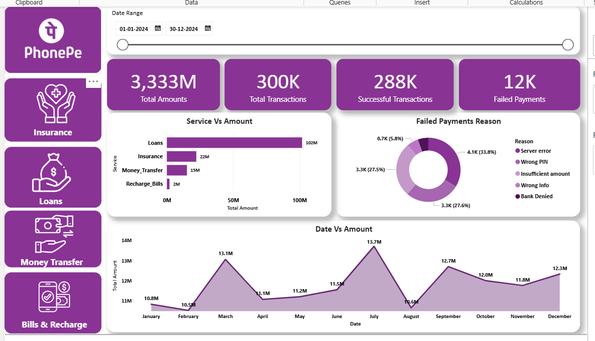
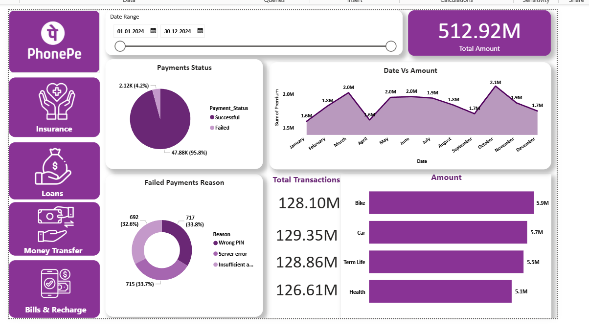
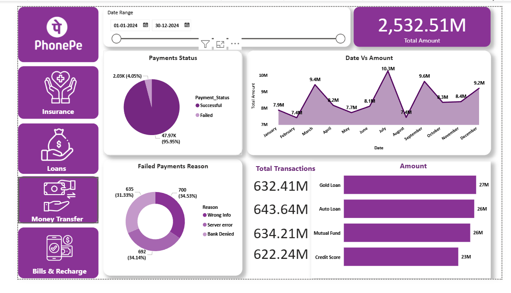

# 📊 PhonePe Business Intelligence Dashboard — Transaction & Failure Analytics

## 🔷 Project Title & Headline
PhonePe Business Intelligence Dashboard built using Power BI to monitor digital payment transactions, analyze service performance, and detect payment failure patterns for better business decision-making.

---

## 📝 Short Description
This project is an end-to-end Power BI dashboard that analyzes 300K+ fintech transactions across multiple services like loans, insurance, money transfer, and bill payments. It helps identify transaction trends, failure causes, and service performance to support operational and strategic decisions.

---

## 🛠 Tech Stack
- Microsoft Power BI  
- Power Query  
- DAX  
- Microsoft Excel  
- Data Modeling  

---

## 📂 Data Source
Transaction dataset collected from Excel files containing user transactions and service records. Data was imported into Power BI and cleaned using Power Query before analysis and visualization.

---

## ✨ Features & Highlights

### 📌 Business Problem
Digital payment platforms handle very large transaction volumes. Payment failures and underperforming services can lead to revenue loss and poor user experience. There is a need for a centralized dashboard to monitor performance and detect issues quickly.

---

### 🎯 Dashboard Goal
- Track total and monthly transaction trends  
- Compare performance across services  
- Monitor success vs failure rates  
- Identify main payment failure reasons  
- Support faster operational decisions  

---

### 📈 Key Visuals Used (and Why)

- **KPI Cards** — show total transactions, amount, and failures for quick executive view  
- **Line Charts** — used for monthly trends to easily detect growth and seasonality  
- **Bar Charts** — compare service categories and contribution clearly  
- **Donut / Pie Charts** — show success vs failure distribution  
- **Service-wise Dashboards** — separate pages for Loans, Insurance, Money Transfer, Bills for focused analysis  
- **Slicers & Filters** — enable interactive exploration by date and service  

---

### 📊 Business Impact & Insights

- Server-related errors are a major cause of failures during peak periods  
- Some services show higher failure rates — need operational attention  
- Transaction growth trends highlight high-usage months  
- Service contribution analysis helps prioritize improvement areas  
- Dashboard enables faster root-cause detection and monitoring  

---

## 🖼 Visual Demo

### Homepage

### Insurance Dashboard

### Loans Dashboard

### Money Transfer Dashboard

### Bills & Recharge Dashboard

---

## ⭐ Project Value
This project demonstrates real-world fintech analytics workflow, multi-page dashboard design, DAX-based KPIs, and business-focused data storytelling using Power BI.

